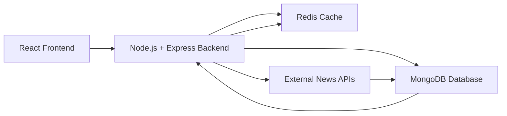

# NewsNova — Full-Stack News Aggregation Platform

## Overview

**NewsNova** is a full-stack news aggregation platform that collects, organizes, and delivers news from multiple sources through a responsive web application.
It goes beyond a simple news app by integrating **user behavior tracking, caching, background jobs, and a modular backend architecture**.

---

## Key Features

### Core Features

* Latest news from multiple categories (Technology, Business, Sports, etc.)
* Advanced search functionality
* Detailed news view
* Responsive UI

### User Features

* User Authentication (JWT-based)
* Secure Signup/Login with OTP verification
* User Profile Management
* Bookmark articles
* Reading History tracking

### Performance & Optimization

* Redis caching for fast API responses
* Rate limiting for security
* Pagination for scalable data handling
* Optimized API calls

### Background Processing

* Cron jobs for automatic news updates
* Scheduled data fetching and storage

### Security

* Authentication & Authorization middleware
* API rate limiting
* Input validation using Zod
* Centralized error handling

---

## System Architecture


---

## Tech Stack

### Frontend

* React.js
* React Router
* Zustand (State Management)
* CSS

### Backend

* Node.js
* Express.js
* MongoDB (Mongoose)
* Redis

### Other Tools

* JWT Authentication
* Nodemailer (Email Service)
* Cron Jobs
* Custom Middleware & Utilities

---

## Project Structure

### Frontend

```
src/
 ├── components/
 ├── pages/
 ├── services/
 ├── routes/
 ├── store/
```

### Backend

```
src/
 ├── controllers/
 ├── services/
 ├── models/
 ├── routes/
 ├── middlewares/
 ├── utils/
 ├── cron/
 ├── config/
```

---

## Installation & Setup

### Clone Repository

```
git clone https://github.com/harshitgoel006/News_Nova.git
cd News_Nova
```

---

### Setup Backend

```
cd backend
npm install
```

Create `.env` file:

```
PORT=5000
MONGO_URI=your_mongodb_uri
JWT_SECRET=your_secret
REDIS_URL=your_redis_url
EMAIL_USER=your_email
EMAIL_PASS=your_password
```

Run backend:

```
npm run dev
```

---

### Setup Frontend

```
cd frontend
npm install
npm run dev
```

---

## API Features

* Authentication & User APIs
* News Fetch & Search APIs
* Bookmark APIs
* Reading History APIs
* Protected REST APIs with JWT authentication

---

## Advanced Concepts Used

* MVC Architecture
* Service Layer Pattern
* Middleware-based request handling
* Caching Strategy with Redis
* Rate Limiting & Security
* Background Job Scheduling (Cron)
* Modular & Maintainable Code Structure

---

## Future Enhancements

* AI-based news summarization
* Personalized news feed
* Daily AI news briefing
* User analytics dashboard
* Fake news detection

---

## Contributing

Pull requests are welcome. For major changes, please open an issue first to discuss what you would like to change.

---

## Contact

**Harshit Goel**
GitHub: https://github.com/harshitgoel006

---

## If you like this project

Give it a ⭐ on GitHub and support the project!

---
